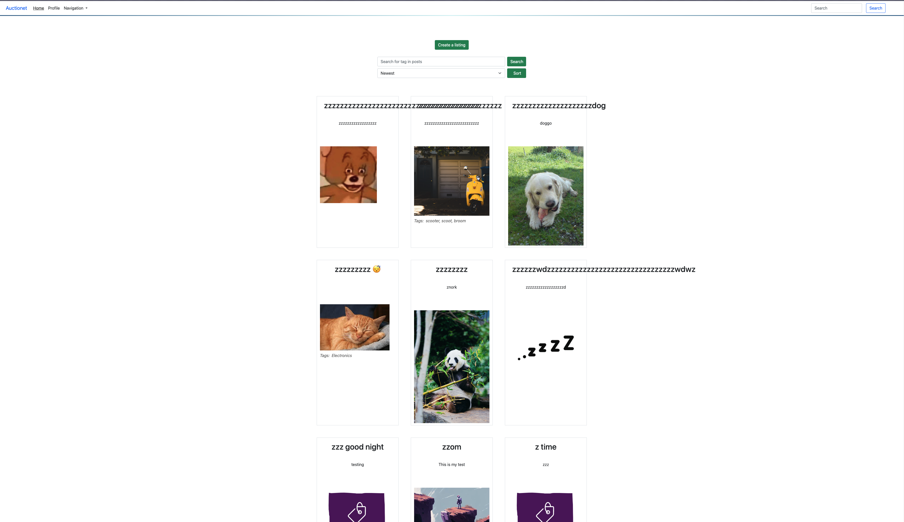

# Semester Project 2



This project serves as an opportunity to integrate the skills acquired throughout the previous semesters into the development of an auction website.

## Description

The project aims to develop a comprehensive auction website where users can both list items for bidding and participate in bidding on items listed by others. Key features include:

- User registration and authentication system
- Management of user credits for transactions
- Listing creation with detailed information and media gallery
- Bidding on listings
- Search functionality for unregistered users

## Built With

The project is built using the following technologies:

### CSS processors

- SASS/SCSS
- [Bootstrap](https://getbootstrap.com)

### Hosting services

- Netlify

### Design applications

- Figma

### Planning applications

- Trello

---

## Getting Started

To get started with the project, follow these steps:

### Installing

1. Clone the repo:

```bash
git clone git@github.com:Nilliz85/Semester-Project-2.git
```

2. Install the dependencies:

```
npm install
```

### Running

Here is where you detail how to run the app. It typically involves the commands you'd need to run to start the project e.g.

To run the app, run the following commands:

```bash
npm run start
```

## Contributing

Contributions to the project are welcome. If you wish to contribute, please follow these guidelines:

- Fork the repository
- Make your changes
- Submit a pull request for review

## Contact

For any inquiries or feedback, feel free to contact us through the following channels:

[My LinkedIn page](www.linkedin.com/in/pernilsendev)
